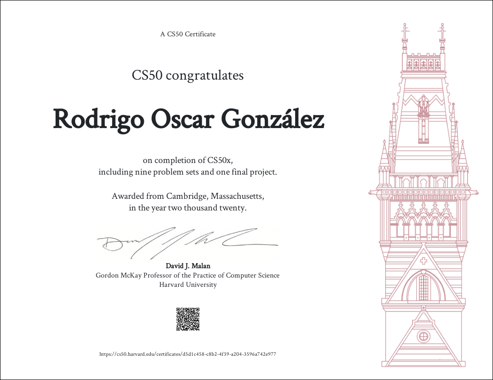

# CS50x
Harvard's CS50x 2020 - Solutions to the psets

This is the code I wrote during Harvard´s CS50 MOOC course (https://cs50.harvard.edu/x/2020/)

- Problem Set 1: https://cs50.harvard.edu/x/2020/psets/1/
- Problem Set 2: https://cs50.harvard.edu/x/2020/psets/2/
- Problem Set 3: https://cs50.harvard.edu/x/2020/psets/3/
- Problem Set 4: https://cs50.harvard.edu/x/2020/psets/4/
- Problem Set 5: https://cs50.harvard.edu/x/2020/psets/5/
- Problem Set 6: https://cs50.harvard.edu/x/2020/psets/6/
- Problem Set 7: https://cs50.harvard.edu/x/2020/psets/7/

Academic Honesty: https://docs.cs50.net/2016/fall/syllabus/cs50.html#academic-honesty

